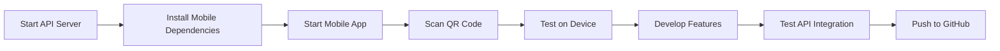

# 🐟 Fish Price Prediction - Mobile App Setup Guide

## 📋 Branch: `price-prediction-mobile-app`

මේ branch එක හදලා තියෙන්නේ **Fish Price Prediction** සඳහා mobile app එකක් run කරන්න.  
Hirusha ගේ quality grading structure එක adapt කරලා price prediction සඳහා configure කරලා තියෙනවා.

---

## 🎯 What's Included

✅ **Mobile App** - React Native + Expo (Hirusha's structure)  
✅ **Price Prediction API** - FastAPI backend (Port 8000)  
✅ **Trained Models** - RF + GB models ready  
✅ **Complete Setup** - මුල ඉදන් run කරන්න පුළුවන්

---

## 🚀 Quick Start - මුල ඉදන් Setup කරන්න

### **Step 1: Start Price Prediction API** 🔧

```powershell
# Terminal 1
cd api-server
python api_server.py
```

**Verify API:**  
Browser එකේ: http://localhost:8000

---

### **Step 2: Install Mobile Dependencies** 📦

```powershell
# Terminal 2  
cd mobile
npm install
# Or if npm install fails:
pnpm install
```

⏳ මේක පළමු වතාවට 3-5 minutes විතර ගන්නවා.

---

### **Step 3: Start Mobile App** 📱

```powershell
# Same Terminal 2 (after install completes)
npm start
```

**Then:**
- 📲 Scan QR code with **Expo Go** app
- 🌐 Press `w` for web version
- 📱 Press `a` for Android emulator
- 🍎 Press `i` for iOS simulator

---

## 📁 Project Structure

```
price-prediction-mobile-app/
├── api-server/              # FastAPI Price Prediction Server
│   ├── api_server.py       # Main API (Port 8000)
│   └── ...
│
├── Backend/
│   └── models/             # Trained ML Models
│       ├── rf_model.pkl    # Random Forest (28 MB)
│       ├── gb_model.pkl    # Gradient Boosting (3 MB)
│       └── ...
│
└── mobile/                 # React Native Mobile App
    ├── src/
    │   ├── api/           # API integration
    │   ├── screens/       # App screens
    │   ├── config/        # API configuration
    │   └── ...
    ├── app/               # Navigation & routes
    ├── components/        # Reusable UI components
    └── package.json       # Dependencies
```

---

## 🔧 API Configuration

### **Mobile App → API Connection**

File: `mobile/src/config/api.ts`

```typescript
export const API_CONFIG = {
  // Fish Price Prediction API
  PREDICTION_API: 'http://localhost:8000',  // Desktop
  // PREDICTION_API: 'http://192.168.1.100:8000',  // Mobile device
  
  // Authentication API (Optional)
  AUTH_API: 'http://localhost:5001',
};
```

### **Environment Variables**

File: `mobile/.env`

```env
# API Configuration
EXPO_PUBLIC_PREDICTION_API_URL=http://localhost:8000

# For mobile device testing:
# Get your computer's IP: ipconfig (Windows) or ifconfig (Mac/Linux)
# EXPO_PUBLIC_PREDICTION_API_URL=http://192.168.1.100:8000
```

---

## 🐛 Common Issues & Solutions

### **Issue 1: API Not Found (Port 8000)**

```powershell
# Check if API is running
curl http://localhost:8000

# If not running:
cd api-server
python api_server.py
```

### **Issue 2: Expo Module Not Found**

```powershell
cd mobile
npm install expo
```

### **Issue 3: Mobile Can't Connect to API**

**On Desktop (localhost):** Works fine  
**On Mobile Device:** ඔයාගේ computer IP address එක use කරන්න

```powershell
# Get your IP
ipconfig  # Windows
# Look for "IPv4 Address" under Wi-Fi

# Update mobile/.env
EXPO_PUBLIC_PREDICTION_API_URL=http://YOUR_IP:8000
```

### **Issue 4: Models Not Found**

Models තියෙන්න ඕනේ: `Backend/models/`

Check:
```powershell
ls Backend/models/*.pkl
```

Should see:
- `rf_model.pkl` (28 MB)
- `gb_model.pkl` (3 MB)
- `le_sinhala.pkl`
- `feature_names.pkl`

---

## 🎯 Testing the App

### **1. API Health Check**

```powershell
curl http://localhost:8000/health
```

### **2. Get Fish List**

```powershell
curl http://localhost:8000/fish
```

### **3. Predict Fish Price**

```powershell
$body = @{
    fish_id = 2
    date = "2026-02-20"
} | ConvertTo-Json

Invoke-WebRequest -Uri "http://localhost:8000/predict" `
    -Method POST `
    -ContentType "application/json" `
    -Body $body
```

---

## 📱 Mobile App Features

Based on Hirusha's structure, adapted for price prediction:

- ✅ Fish price predictions
- ✅ Historical price trends  
- ✅ Multiple fish species support
- ✅ Date-based forecasting
- ✅ Beautiful UI with React Native
- ✅ Expo for easy development

---

## 🔄 Development Workflow



---

## 🌐 Ports Used

| Service | Port | URL |
|---------|------|-----|
| Price Prediction API | 8000 | http://localhost:8000 |
| Mobile App (Web) | 19000 | Expo DevTools |
| Mobile App (Metro) | 19001 | Metro Bundler |
| Auth API (Optional) | 5001 | http://localhost:5001 |

---

## 📚 Next Steps

1. **Start API:** `cd api-server && python api_server.py`
2. **Start Mobile:** `cd mobile && npm start`
3. **Test on Device:** Scan QR code with Expo Go
4. **Develop:** Add your price prediction screens
5. **Deploy:** Build for Android/iOS

---

## 🎨 UI Customization

Mobile app uses:
- **React Native** - Core framework
- **Expo** - Development platform  
- **NativeWind** - Tailwind CSS for React Native
- **React Navigation** - Navigation

To customize:
- Edit screens: `mobile/app/` or `mobile/src/screens/`
- Update components: `mobile/components/`
- Modify styles: `mobile/global.css`

---

## 🤝 Credits

- **Hirusha:** Base mobile app structure (Fish quality grading)
- **Anushanga:** Price prediction model & API integration
- **Team:** Complete fish analysis system

---

## 📞 Support

**Common Commands:**

```bash
# API Server
cd api-server && python api_server.py

# Mobile App - First Time
cd mobile && npm install && npm start

# Mobile App - Regular
cd mobile && npm start

# Check API
curl http://localhost:8000

# Get Fish List  
curl http://localhost:8000/fish
```

**Troubleshooting:**
1. API not running? → Start api_server.py
2. Mobile errors? → Delete node_modules, run npm install
3. Can't connect? → Check IP address in .env
4. Models missing? → Check Backend/models/ folder

---

**සියල්ල ready! Just follow Quick Start steps and run! 🚀**

Happy Coding! 🐟📱💰
