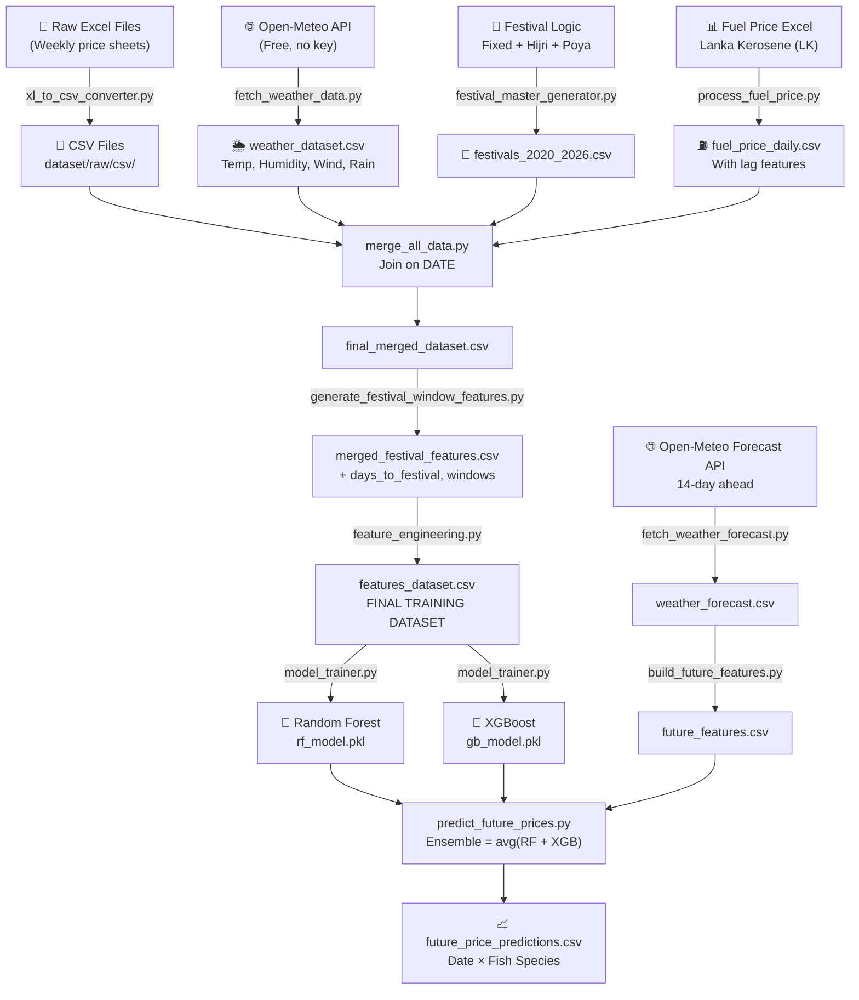

# 🐟 Fish Price Prediction — AI & ML Component Explanation
### Final Year Project Viva Preparation Guide

---

## 1. System Overview

The Fish Price Prediction component is an **end-to-end Machine Learning pipeline** that:
1. Collects raw fish price data (from Excel/CSV files)
2. Enriches it with external data (weather, fuel prices, festivals)
3. Engineers meaningful features
4. Trains two ML models (Random Forest + XGBoost) in an ensemble
5. Predicts **future fish wholesale prices** for Sri Lanka

> [!IMPORTANT]
> The system uses an **ensemble of two algorithms** — Random Forest and XGBoost — whose predictions are averaged to produce the final price. This reduces overfitting and improves robustness.

---

## 2. Directory Structure

```
model/fish_price_prediction/
│
├── run_excel_pipeline.py          ← MASTER PIPELINE (runs everything in order)
├── config.py                      ← All hyperparameters and file paths
├── main.py                        ← Entry point
│
├── scripts/                       ← Data collection & feature scripts
│   ├── xl_to_csv_converter.py     ← Step 0: Excel → CSV
│   ├── festival_master_generator.py ← Step 1: Generate festival calendar
│   ├── fetch_weather_data.py      ← Step 2: Historical weather (Open-Meteo API)
│   ├── process_fuel_price.py      ← Step 2b: Kerosene fuel price processing
│   ├── merge_all_data.py          ← Step 3: Merge all data sources
│   ├── generate_festival_window_features.py ← Step 4: Festival proximity features
│   ├── feature_engineering.py    ← Step 5: Final feature set creation
│   ├── fetch_weather_forecast.py  ← Step 7: Future weather forecast
│   ├── build_future_features.py   ← Step 8: Build features for future dates
│   └── predict_future_prices.py   ← Step 9: Run batch future predictions
│
├── train/
│   ├── model_trainer.py           ← Core ML training class (RF + XGBoost)
│   └── _run_training.py           ← Step 6: Training entry point
│
├── predict/
│   ├── price_predictor.py         ← Inference class (load models, predict)
│   └── gui.py                     ← Tkinter GUI for interactive prediction
│
├── models/                        ← Saved .pkl model files (after training)
│   ├── rf_model.pkl
│   ├── gb_model.pkl               ← XGBoost model (saved as gb)
│   ├── feature_names.pkl
│   └── le_sinhala.pkl             ← Label Encoder for fish species
│
└── data/
    └── fish_names.csv             ← Fish species (Sinhala + Common names)
```

---

## 3. Complete Data Flow Diagram



---

## 4. Pipeline Execution — Step by Step

The master file `run_excel_pipeline.py` orchestrates **9 sequential steps**:

| Step | Script | Purpose |
|------|--------|---------|
| 0 | `xl_to_csv_converter.py` | Convert `.xlsx` → `.csv` (skips if already done) |
| 1 | `festival_master_generator.py` | Build Sri Lankan festival calendar (2020–2026) |
| 2 | `fetch_weather_data.py` | Download historical weather for 7 SL ports |
| 2b | `process_fuel_price.py` | Process Lanka Kerosene price → daily CSV with lags |
| 3 | `merge_all_data.py` | Join: prices + fuel + weather + festivals |
| 4 | `generate_festival_window_features.py` | Add proximity-to-festival features |
| 5 | `feature_engineering.py` | Add time/season/weather effect features |
| 6 | `_run_training.py` → `model_trainer.py` | Train RF + XGBoost, save `.pkl` files |
| 7 | `fetch_weather_forecast.py` | Fetch 14-day future weather forecast |
| 8 | `build_future_features.py` | Build feature matrix for future dates |
| 9 | `predict_future_prices.py` | Predict prices for all fish × future dates |

> [!NOTE]
> Every step uses `critical=False` so the pipeline continues even if optional data (weather, fuel) is unavailable.

---

## 5. ML File Deep Dives

---

### 5.1 `config.py` — Central Configuration

This file is the **single source of truth** for all parameters. It defines:

**Model Hyperparameters:**
```python
# Random Forest
RF_PARAMS = {
    "n_estimators": 100,   # 100 decision trees in the forest
    "max_depth": 10,        # Max depth per tree (prevents overfitting)
    "min_samples_split": 5,
    "min_samples_leaf": 2,
    "random_state": 42,
    "n_jobs": -1            # Use all CPU cores
}

# XGBoost
XGB_PARAMS = {
    "n_estimators": 100,
    "max_depth": 6,
    "learning_rate": 0.1,   # Shrinkage / step size
    "subsample": 0.8,        # 80% of data per tree (reduces overfitting)
    "random_state": 42
}
```

**Ensemble Settings:**
```python
ENSEMBLE_METHOD = "average"  # Simple average of RF and XGB
RF_WEIGHT = 0.5
XGB_WEIGHT = 0.5
TRAIN_TEST_SPLIT = 0.2       # 80% train, 20% test
CV_FOLDS = 5                  # 5-fold cross validation
```

**Feature Groups defined here:** `TIME_FEATURES`, `SEASONAL_FEATURES`, `SPECIAL_DAY_FEATURES`, `ENVIRONMENTAL_FEATURES`

---

### 5.2 `xl_to_csv_converter.py` — Data Ingestion

**Purpose:** Converts weekly fish price Excel files into CSV format.

**Key Logic:**
- Scans `dataset/raw/xl/` for `.xlsx`, `.xls`, `.xlsm`, `.xlsb` files
- **Skips already-converted files** (idempotent — safe to run multiple times)
- Saves to `dataset/raw/csv/`

**File naming convention the CSVs must follow:**
```
January_1st_week_2025.csv
February_2nd_week_2024.csv
```
The date is **parsed from the filename** in later scripts.

---

### 5.3 `festival_master_generator.py` — Festival Calendar

**Purpose:** Creates a master CSV of all Sri Lankan public holidays and religious events from 2020–2026.

**Three types of festivals handled:**

| Type | Method | Examples |
|------|--------|---------|
| Fixed-date | Hardcoded date strings | New Year (Jan 1), Christmas (Dec 25), Independence Day (Feb 4) |
| Semi-fixed | Hardcoded per year | Sinhala/Tamil New Year (Apr 13–14) |
| Islamic (Hijri) | `hijridate` library | Eid al-Fitr (Shawwal 1), Eid al-Adha (Dhul Hijja 10) |
| Buddhist Poya | Full moon dates list | Vesak, Poson, Esala, etc. (12 per year for 2024–2025) |
| API backup | Calendarific.com API | Fetches if API key is available in `.env` |

**Output:** `festivals_2020_2026.csv` with columns: `festival_name`, `festival_date`

**Viva Point:** Poya days are significant because on those days, Buddhist Sri Lankans do not eat fish (or eat less), which **directly reduces demand and affects price.**

---

### 5.4 `fetch_weather_data.py` — Historical Weather

**Purpose:** Downloads historical daily weather data for **7 Sri Lankan fishing ports** using the **Open-Meteo Archive API** (free, no API key needed).

**Ports covered:**
```
Colombo, Negombo, Galle, Trincomalee, Jaffna, Hambantota, Kalpitiya
```

**Weather variables fetched:**
- `temperature_2m_mean` → daily average temperature (°C)
- `relative_humidity_2m_mean` → humidity (%)
- `wind_speed_10m_max` → max wind speed (km/h)
- `precipitation_sum` → total rainfall (mm)

**Bad Weather Flag:**
```python
bad_weather = 1 if (rain > 5 or wind_speed > 30) else 0
```
This binary flag tells the model: "was it dangerous to go fishing today?"

**Output:** `weather_dataset.csv` — all ports, all dates, daily resolution.

---

### 5.5 `process_fuel_price.py` — Fuel Price Feature

**Purpose:** Processes Lanka Kerosene (LK) fuel prices — the primary fuel used by Sri Lankan fishing boats — from an Excel file into a **daily forward-filled time series**.

**Why fuel price matters for fish price:**
- Higher kerosene price → higher fishing cost → less supply → higher fish price
- Price changes don't happen daily, so **forward-fill** carries last known price forward

**Derived lag features created:**
```python
lk_price_lag1        # yesterday's fuel price
lk_price_lag2        # two days ago fuel price
lk_price_change      # daily absolute change
lk_price_pct_change  # daily % change
```

**Viva Point:** Lag features allow the model to detect **momentum** — e.g., if fuel price has been rising for 2 days, that pattern influences future fish price.

---

### 5.6 `merge_all_data.py` — Data Integration Hub

**Purpose:** Performs a **4-way LEFT JOIN** on date to combine all data sources.

**Join order:**
```
Fish Prices
    ← LEFT JOIN Fuel Prices (on date)
    ← LEFT JOIN Weather (on date, Colombo only)
    ← LEFT JOIN Festivals (on date)
```

**Key decisions:**
- Weather is **filtered for Colombo** only (main fish market location)
- Weather is **aggregated by date** (mean temp, mean humidity, max wind, sum rainfall)
- Festival join uses `fillna(0)` for non-festival days
- Duplicate prices: **highest price is kept** per date+fish combination

**Output:** `final_merged_dataset.csv` with all data sources joined by date.

---

### 5.7 `generate_festival_window_features.py` — Proximity Features

**Purpose:** Adds time-proximity features that capture the **economic effect of upcoming festivals** on price.

**Key features generated:**

| Feature | Description |
|---------|-------------|
| `is_festival_day` | 1 if today is a festival |
| `days_to_festival` | Days until next festival (default 999 = no festival near) |
| `days_after_festival` | Days since last festival |
| `before_festival_window` | 1 if within 7 days BEFORE a festival |
| `after_festival_window` | 1 if within 7 days AFTER a festival |

**Viva Point:** Fish prices typically **spike before major festivals** (Vesak, Sinhala New Year) as demand increases. The 7-day window captures this pre-festival buying surge.

---

### 5.8 `feature_engineering.py` — Final Feature Creation

**Purpose:** Creates the **complete feature matrix** that the ML model is trained on. This is the most important preprocessing step.

**All features created:**

#### Time Features
```python
day_of_week     # 0=Monday ... 6=Sunday
month           # 1–12
year            # 2024, 2025, etc.
week_of_year    # ISO week number (1–53)
is_weekend      # 1 if Saturday/Sunday
```

#### Cyclical Encoding (Important ML concept!)
```python
month_sin = sin(2π × month / 12)
month_cos = cos(2π × month / 12)
```
> [!TIP]
> **Why sine/cosine encoding?** Regular month numbers (1–12) imply December (12) is far from January (1), but cyclically they are adjacent. Sin/cos encoding wraps the year into a circle, correctly capturing seasonal continuity.

#### Sri Lankan Fishing Season Features
```python
is_waragam_west   # May–Sep: SW monsoon, rough seas on West coast
is_waragam_east   # Oct–Jan: NE monsoon, rough seas on East coast
is_awaragam       # Feb–Apr: Calm season, abundant supply, lower prices
fishing_season    # 0=Awaragam, 1=Waragam-West, 2=Waragam-East
is_rough_sea_season  # 1 if either waragam season is active
```

#### Weather, Festival & Fuel Features
```python
weather_effect       # 1 if rainfall > 10mm
is_poya              # 1 if today is a Poya (full moon) day
is_holiday           # 1 if poya OR festival day
poya_effect          # same as is_poya (alias)
festival_effect      # is_festival_day value
price_behavior_signal = weather_effect + poya_effect + festival_effect
# Combined signal: 0=normal day, 3=worst case (bad weather + poya + festival)

lk_price, lk_price_lag1, lk_price_lag2   # Kerosene prices
lk_price_change, lk_price_pct_change      # Price momentum
lk_price_rose                              # 1 if fuel price rose today
```

**Output:** `features_dataset.csv` — the final training dataset.

---

### 5.9 `model_trainer.py` — The Core ML Engine

**Class:** `FishPriceModelTrainer`

**What it does end-to-end:**

#### Step A: Load Data
- Reads `features_dataset.csv`
- Parses `date` column as datetime

#### Step B: Create ML Features (`create_ml_features`)
- Re-derives time and season features from scratch on the loaded dataframe
- Ensures consistency between training and inference

#### Step C: Prepare Training Data (`prepare_training_data`)
- **Label Encodes** fish Sinhala names → integer codes
  ```python
  le_sinhala.fit_transform(['කට්ටලෝව', 'ලේන්', 'හීරා', ...])
  # → [2, 5, 3, ...]
  ```
- Drops non-numeric / non-feature columns: `date`, `sinhala_name`, `common_name`, `wholesale_price`
- **Target variable (y):** `wholesale_price` (or `price` as fallback)
- Handles missing values: `X.fillna(X.mean())`

#### Step D: Train Models (`train_models`)
```python
# 80/20 train-test split
X_train, X_test, y_train, y_test = train_test_split(X, y, test_size=0.2)

# Model 1: Random Forest
rf_model = RandomForestRegressor(n_estimators=100, max_depth=10, ...)
rf_model.fit(X_train, y_train)

# Model 2: XGBoost
xgb_model = XGBRegressor(n_estimators=100, learning_rate=0.1, ...)
xgb_model.fit(X_train, y_train)
```

**Evaluation metrics calculated:**
- **MAE** (Mean Absolute Error) — average price error in Rupees
- **R²** (R-squared) — how much variance is explained (closer to 1 = better)
- **5-Fold Cross Validation** — tests generalization across 5 different data splits

#### Step E: Save Models (`save_models`)
All models serialized to `models/` directory using `pickle`:
- `rf_model.pkl` — Random Forest
- `gb_model.pkl` — XGBoost
- `feature_names.pkl` — list of feature column names (critical for inference alignment)
- `le_sinhala.pkl` — Label Encoder for fish names

---

### 5.10 `price_predictor.py` — Inference Engine

**Class:** `FishPricePredictor`

**Purpose:** Loads saved models and answers: *"What will the price of [fish] be on [date]?"*

**`create_features(date, fish_name)` method:**
Builds a **single-row feature vector** for any arbitrary date and fish — same features as training.

**`predict(fish_name, date)` method:**
```python
rf_pred  = rf_model.predict(features)[0]    # Random Forest prediction
xgb_pred = xgb_model.predict(features)[0]  # XGBoost prediction

# Ensemble (average)
ensemble_pred = (rf_pred + xgb_pred) / 2

# Returns dict with both individual and ensemble prediction
return {'price': ensemble_pred, 'rf_prediction': rf_pred, 'xgb_prediction': xgb_pred, ...}
```

**`predict_range(fish_name, date, days_before=15, days_after=15)` method:**
- Predicts prices for a 30-day window around any date
- Used by the GUI to display price trends

---

### 5.11 `fetch_weather_forecast.py` — Future Weather

**Purpose:** Fetches **14-day ahead weather forecast** from Open-Meteo Forecast API.

- Uses same 7 port locations as historical weather
- Same fields: temp, humidity, wind, rainfall, bad_weather flag
- Output: `weather_forecast.csv`

---

### 5.12 `build_future_features.py` — Future Feature Matrix

**Purpose:** Constructs the feature matrix for **future dates** (same structure as training features).

**Steps:**
1. Load `weather_forecast.csv` → aggregate by date (same as historical)
2. Attach festival features (from `festivals_2020_2026.csv`)
3. Attach fuel prices (forward-fill last known price for future dates)
4. Add all time + season + effect features (same logic as `feature_engineering.py`)

**Output:** `future_features.csv` — one row per future date

---

### 5.13 `predict_future_prices.py` — Batch Prediction

**Purpose:** Generates predictions for **every fish species × every future date**.

**Cross-join logic:**
```python
# future dates: e.g., 14 rows (next 14 days)
# fish species: e.g., 40 species
# combined: 14 × 40 = 560 prediction rows

future_df["key"] = 1
fish_df["key"] = 1
combined = future_df.merge(fish_df, on="key").drop("key")
```

**Ensemble prediction:**
```python
rf_pred  = rf.predict(X)
gb_pred  = gb.predict(X)
ensemble = (rf_pred + gb_pred) / 2
pred_df["predicted_price"] = ensemble
```

**Output:** `future_price_predictions.csv` with columns: `date, fish_id, sinhala_name, common_name, predicted_price`

---

## 6. The Two ML Algorithms Explained

### 6.1 Random Forest Regressor

- An **ensemble of 100 decision trees** (n_estimators=100)
- Each tree is trained on a **random subset** of data and features (bagging)
- Final prediction = **average of all 100 tree predictions**
- `max_depth=10` prevents any single tree from memorizing training data
- **Strength:** Robust to outliers, handles nonlinear relationships well

### 6.2 XGBoost Regressor

- **Gradient Boosting** — trees are added **sequentially**, each correcting errors of the previous
- `learning_rate=0.1` — small steps to prevent overshooting
- `subsample=0.8` — each tree uses 80% of training data randomly
- **Strength:** Often outperforms RF on structured tabular data, captures complex patterns

### 6.3 Why Ensemble Both?

| Aspect | Random Forest | XGBoost |
|--------|--------------|---------|
| Training | Parallel (independent trees) | Sequential (boosting) |
| Bias-Variance | Low variance, slightly high bias | Low bias, can overfit |
| Speed | Fast | Slower but more accurate |
| Combined | **Averaging reduces variance from XGB + bias from RF** | → More stable predictions |

---

## 7. Feature Importance Summary

The most impactful features for fish price prediction (in order of importance):

1. **`fish_encoded`** — Species type is the #1 price driver
2. **`fishing_season`** / `is_waragam_west` / `is_waragam_east` — Supply disruption from monsoon
3. **`month`** / `month_sin` / `month_cos` — Seasonal price cycles
4. **`lk_price`** — Fuel cost directly impacts fishermen's operational costs
5. **`is_poya`** / `poya_effect`** — Demand drop on Buddhist full moon days
6. **`before_festival_window`** — Pre-festival demand surge
7. **`weather_effect`** — Bad weather reduces daily catch
8. **`is_weekend`** — Higher consumer demand on weekends

---

## 8. Key Technical Concepts for Viva

### Q: Why Label Encoding for fish names?
ML algorithms require numeric inputs. `LabelEncoder` maps each Sinhala fish name to a unique integer. The encoder is **saved as `le_sinhala.pkl`** so inference uses the exact same mapping as training.

### Q: What is Cross-Validation and why 5 folds?
5-fold CV splits the dataset into 5 equal parts, trains on 4, tests on 1, rotating 5 times. The average R² across all 5 gives a **more reliable performance estimate** than a single train/test split.

### Q: What does R² mean?
R² = 1.0 means perfect predictions. R² = 0.8 means the model explains 80% of the price variance. Anything above 0.75 is considered good for price prediction.

### Q: Why forward-fill fuel prices?
Fuel prices in Sri Lanka change only on specific gazette dates. Between changes, the price stays constant. Forward-filling propagates the last known price to all subsequent days until the next official change.

### Q: Why `critical=False` in the pipeline?
This makes the system **fault-tolerant**. If weather API is down or fuel data is missing, the pipeline continues. The model will simply have `0` for those missing features and still produce a prediction (though less accurate).

### Q: What is the `price_behavior_signal`?
A composite integer (0–3) that aggregates unusual conditions:
- `0` = Normal trading day
- `1` = One disruption (e.g., bad weather)
- `2` = Two disruptions (e.g., Poya + bad weather)
- `3` = Maximum disruption (bad weather + Poya + festival)

### Q: How does the system handle unseen fish species at inference?
```python
def safe_encode(name):
    if name in known:
        return le_sinhala.transform([name])[0]
    return 0  # Unknown species → code 0 (default)
```
Unknown species get code 0 — a safe fallback.

---

## 9. Data Flow Summary Table

| Stage | Input | Process | Output |
|-------|-------|---------|--------|
| Ingestion | `.xlsx` weekly price files | Convert to CSV | Raw CSV files |
| Weather | Open-Meteo API | HTTP GET, parse JSON | `weather_dataset.csv` |
| Festivals | Hardcoded + Hijri calc + API | Date generation | `festivals_2020_2026.csv` |
| Fuel | `Fuel Price.xlsx` | Parse, forward-fill, add lags | `fuel_price_daily.csv` |
| Merge | All 4 sources above | LEFT JOIN on date | `final_merged_dataset.csv` |
| Festival FE | Merged data + festivals | Proximity windows | `merged_festival_features.csv` |
| Feature Eng | Festival-enriched data | Time/season/effects | `features_dataset.csv` ← **TRAIN** |
| Training | `features_dataset.csv` | RF + XGBoost fit | `*.pkl` model files |
| Forecast | Open-Meteo Forecast API | HTTP GET | `weather_forecast.csv` |
| Future FE | Forecast + festivals + fuel | Same FE as training | `future_features.csv` |
| Prediction | Future features + models | Ensemble inference | `future_price_predictions.csv` |

---

## 10. Evaluation Metrics Used

| Metric | Formula | What it tells you |
|--------|---------|------------------|
| MAE | mean(\|y - ŷ\|) | Average error in Rupees |
| RMSE | sqrt(mean((y-ŷ)²)) | Penalizes large errors more |
| R² | 1 - SS_res/SS_tot | % of variance explained |
| MAPE | mean(\|y-ŷ\|/y) × 100 | % error relative to actual price |
| CV R² | 5-fold average R² | Generalization ability |

---

*Document prepared for Final Year Project Viva — Fish Price Prediction ML Component*
